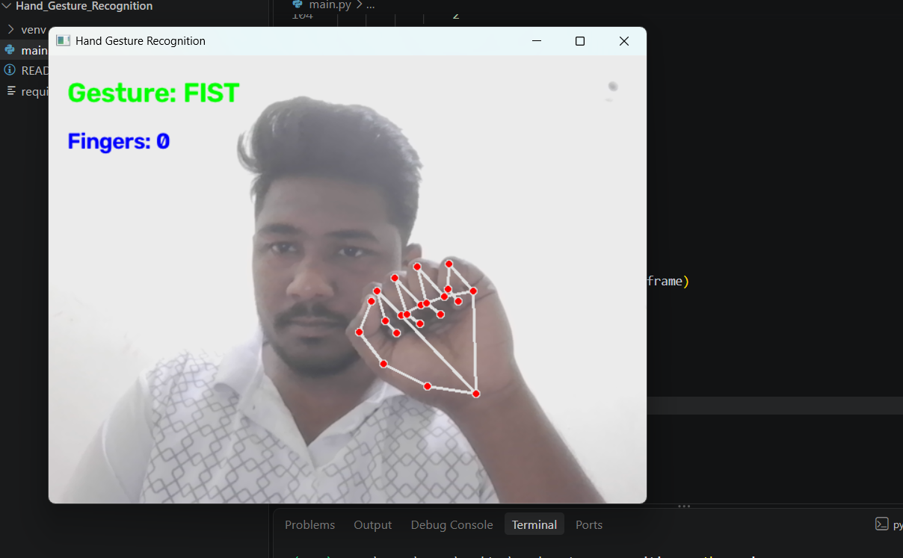
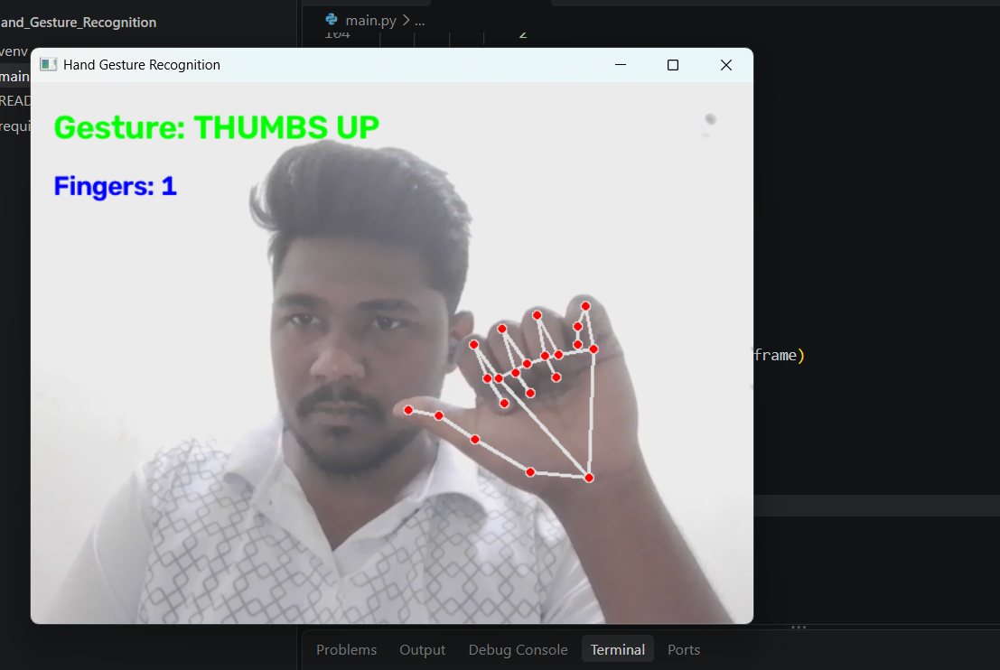
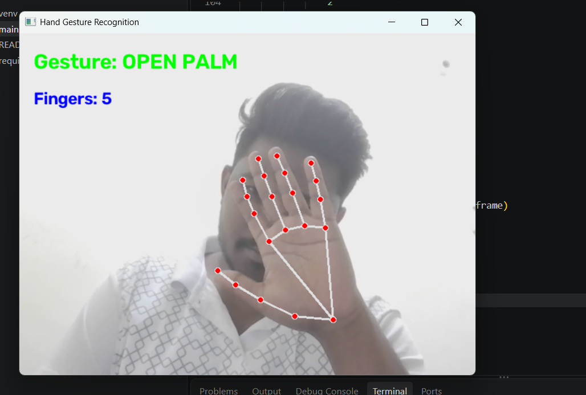
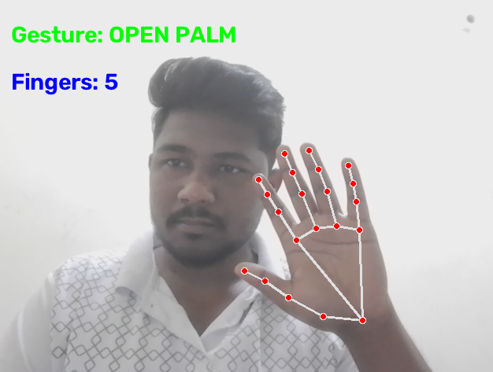

# ✋ Hand Gesture Recognition System

A real-time Hand Gesture Recognition System built using Python, OpenCV, MediaPipe, and PyAutoGUI. The application detects hand landmarks through a webcam, recognizes gestures, and performs system actions such as screenshot capture and volume control.

## 🚀 Features

- Real-time hand tracking using MediaPipe
- 21-point hand landmark detection
- Finger counting
- Gesture recognition
- Screenshot capture using hand gestures
- System volume control
- Live webcam feed with gesture display

## 🛠️ Technologies Used

- Python
- OpenCV
- MediaPipe
- PyAutoGUI

## 📂 Project Structure

```text
Hand-Gesture-Recognition/
│
├── main.py
├── requirements.txt
├── README.md
├── LICENSE
└── screenshots/
```

## 🎮 Supported Gestures

| Gesture | Action |
|----------|----------|
| 🖐 Open Palm | Capture Screenshot |
| 👍 Thumbs Up | Volume Up |
| ✌ Two Fingers | Volume Down |
| ✊ Fist | Detect Closed Hand |

## 📸 Project Screenshots

### Open Palm Detection


### Thumbs Up Detection


### Two Fingers Detection


### Fist Detection


## ⚙️ Installation

Clone the repository:

```bash
git clone https://github.com/purna00/Hand-Gesture-Recognition.git
```

Move into the project directory:

```bash
cd Hand-Gesture-Recognition
```

Install dependencies:

```bash
pip install -r requirements.txt
```

Run the application:

```bash
python main.py
```

## 📈 Future Improvements

- Gesture-controlled mouse cursor
- Presentation control using gestures
- Custom gesture training
- Media player controls
- Gesture-based smart home automation

## 👨‍💻 Author

**Molugu Purna Shankar**

GitHub: https://github.com/purna00

## 📄 License

This project is licensed under the MIT License.
